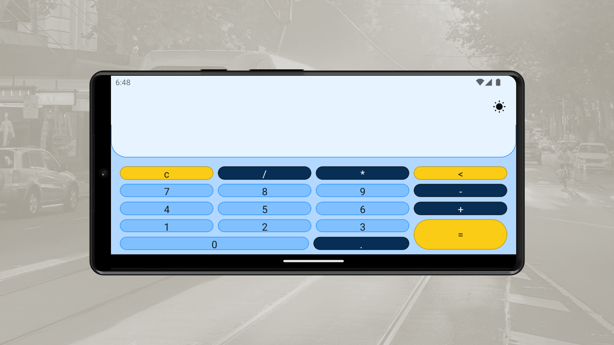

<h1 align="center">
Calculator App With Dart, Flutter, Material 3, Shared Preferences, Bloc, Testing Library, Get It, Futures

</h1>

 

 

  <a href="#description">Description</a> &nbsp;&nbsp;&nbsp;|&nbsp;&nbsp;&nbsp <a href="#install">Install</a> &nbsp;&nbsp;&nbsp;|&nbsp;&nbsp;&nbsp <a href="#technologies">Technologies</a> &nbsp;&nbsp;&nbsp;|&nbsp;&nbsp;&nbsp <a href="#related">Related</a> &nbsp;&nbsp;&nbsp;|&nbsp;&nbsp;&nbsp <a href="#contact">Contact</a>

 
 

<h3 id="description">✍️ Description:</h3>

Working with Flutter to me is always a pleasure, all the library api are handy and easy to use; it is fast to create any kind of application with these tools. Creating a simple calculator app with a hexagonal approach, as this one, provides the glue of your idea and a robust, maintainable and reliable software and, being fair, dart reminds me of developing on javascript but with my beloved object-orienting fashion. Lovely

 

<h3 id="technologies">🚀 Technologies:</h3>

To build this project is used:

- Dart
- Flutter
- Flutter Testing Library
- Eval Ex
- Shared Preferences
- Bloc
- Get It
- Material 3 (Material You)

 

<h3 id="related">♟️ Related:</h3>

See more:

<ul>
  <li><a href="https://github.com/samuelcarvalhodeveloper/Pokedex-With-Next-Js-Typescript-Axios-Jest-React-Testing-Library-PHP-Laravel-Python-Django">Web Pokedex</a></li>
  <li><a href="https://github.com/samueldecarvalhodeveloper/Calculator-With-Next-Js-Nginx-Load-Balancer-Proxy-Server-Server-Side-Rendering-Typescript-Sass">Web Calculator</a></li>
  <li><a href="https://github.com/samuelcarvalhodeveloper/Notes-App-With-React-Native-Expo-Custom-Hooks-Typescript-Sqlite3-Prettier-Eslint-EditorConfig-Jest">Notes App With React Native</a></li>
</ul>

 

<h3 id="contact">✉️ Contact:</h3>

**Email:**
<a href="mailto:personal.samuelcarvalho@gmail.com">personal.samuelcarvalho@gmail.com</a>

 
 
